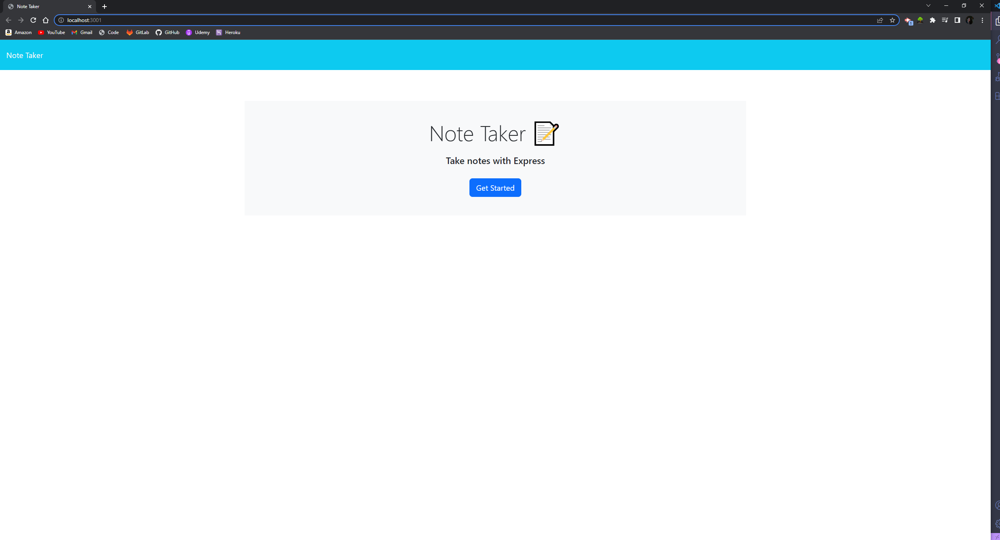
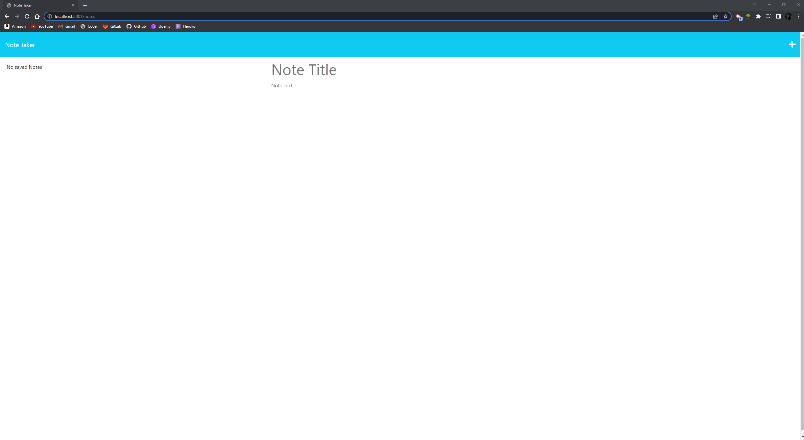
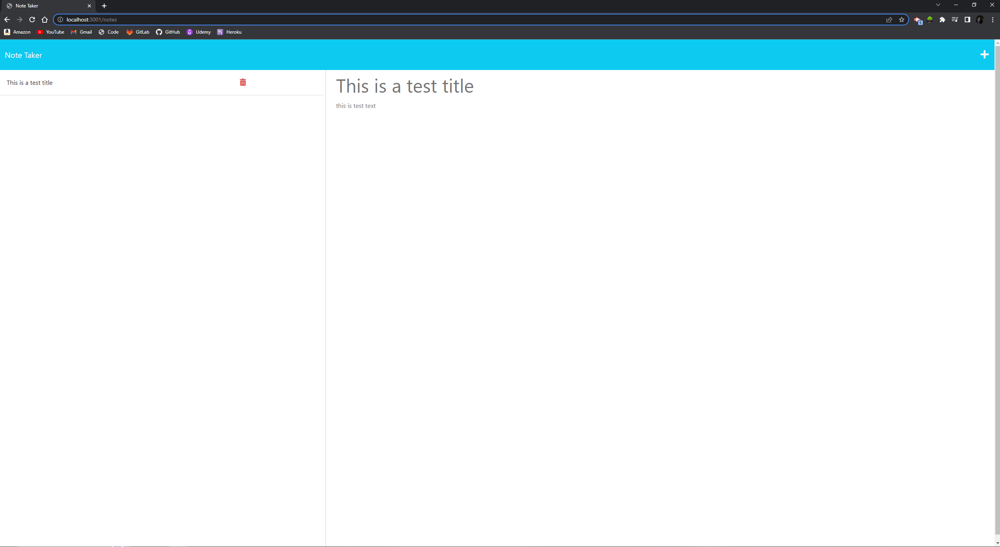

# Note Taker Starter Code

## Description

The motivation behind building this project was to gain a better understanding of building the back end of an application and linking it to the front end. This project was built so I could have future reference to code that involves back end development. This application allows users to write notes and save them so they can be referenced. Much was learned about back end development, specifically routing, GET and POST.

## Screenshot

## Link

https://stormy-oasis-82819-2f53aacc0a0d.herokuapp.com/